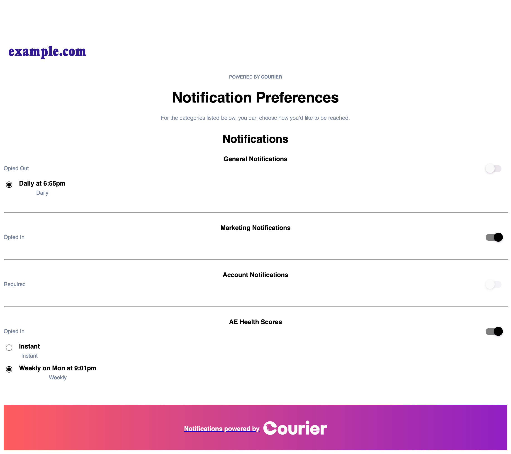

# [React Preferences Overview](#overview)

A set of UI components for allowing your end users to manage their preferences. These set of React components supports Branding, Tenants, Draft, Sections, Topics, Digest Schedules, Status (OPTED_IN, OPTED_OUT, and REQUIRED), and Preferred Channels.

- If you're looking to implement Preferences with your own custom UI in React, we encourage you to look at [react-hooks](../react-hooks/README.md) and use this repository's components as inspiration.
- If you're looking for a turnkey preferences page on other web frameworks, you could use our [hosted preference page](https://www.courier.com/docs/platform/preferences/preference-center/hosted-page/) or check out our [Components repository](../components/README.md) for self-hosting



## [Installation](#installation)

```
yarn add @trycourier/react-provider @trycourier/react-preferences
```
